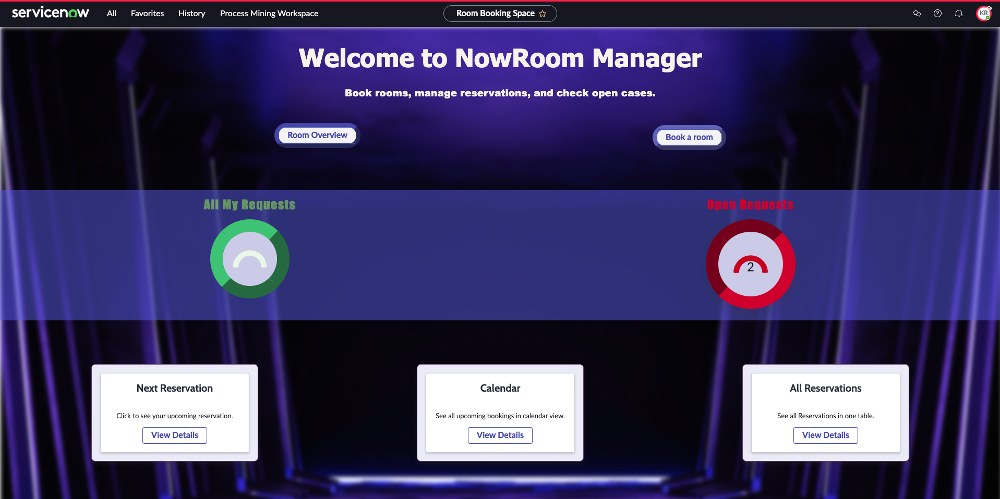

# NowRoom – Room Booking (ServiceNow)

Room-booking app built with **ServiceNow App Engine / Workspace** — easily reserve, approve, and manage rooms.
> **Stack:** App Engine Studio, Flow Designer, UI Builder, GitHub (Source Control)

---

## Table of Contents
- [Features](#features)
- [Screenshots](#screenshots)
- [Roles & Permissions](#roles--permissions)
- [Data Model](#data-model)
- [Quick Start](#quick-start)
- [Development & Git Flow](#development--git-flow)
- [Releases / Tags](#releases--tags)
- [Mini-Roadmap](#roadmap)
- [Troubleshooting](#troubleshooting)
- [License](#license)

## Features
- Search and reserve rooms
- Approval flow for reservations
- Cancellation flow so users can cancel their own reservations
- Overview of open and upcoming reservations
- Roles & permissions in Workspace and on the Meeting Room form

## Screenshots
- **Manager Workspace**  
  
- **Fulfiller Workspace**  
  

## Roles & Permissions
- `nowroom.user`: View and access the NowRoom application menu
- `meeting_room.user`: View meeting rooms
- `reservation.user`: View and create reservations
- `nowroom.admin`: Extended access to NowRoom module settings
- `approver.user`: Approve or reject reservations
- `room.manager`: Manage rooms (capacity, equipment, create new meeting rooms)

## Data Model
- **Tables:** `Reservation` (extends `task`), `Meeting Room`, `Notice`
- **Approvals:** Implemented via Flow Designer approval action and `sysapproval_approver`
- **Relationships:** `Reservation` → `Meeting Room` (many-to-one)
- **Flows:** On create/update (approval flow), cancellation flow

## Quick Start

### Prerequisites
- ServiceNow instance (Developer / PDI)
- Access to **App Engine Studio / ServiceNow Studio**
- GitHub repo and **Personal Access Token (PAT)** with `repo` scope

### Import / Setup
1. **AES → Source control → Link to source control**  
   Repo: `https://github.com/PaulineTrotzer/NowRoom.git`  
   Branch: `main` · Credential: GitHub **PAT**
2. **Pull from repository** (if the app isn’t present yet).
3. Open the app → verify **Tables & Flows** → launch the Workspace.

> Hint: If the Workspace doesn’t load, clear the browser cache or open/save once in Classic UI.

## Development & Git Flow
- Make changes in AES → **Source control → Commit changes** → **Submit/Push**
- Optional: Create feature branches in AES and merge via Pull Request  
  (linear history on `main`, no force pushes).

## Releases / Tags
- In AES: **Source control → Create tag** (e.g., `v1.0.0`) for releases.
- Recommended versioning: [SemVer](https://semver.org/) (`MAJOR.MINOR.PATCH`).

## Roadmap
- [ ] Calendar view with automatic room blocking (supports approvers)
- [ ] Workspace toast notifications / emails
- [ ] Automated follow-up tasks linked to reservations (e.g., room setup/cleanup)

## Troubleshooting
- **“Record not found” on deep link:** Ensure the Workspace route is registered and the table/page is configured in the Experience.
- **No write access:** Check roles (`nowroom.user`, `reservation.user`, `approver.user`, `room.manager`, `nowroom.admin`) and table/field ACLs.
- **Source control fails:** Verify PAT scopes; re-link if needed.

## License
MIT © 2025 Pauline Trotzer

